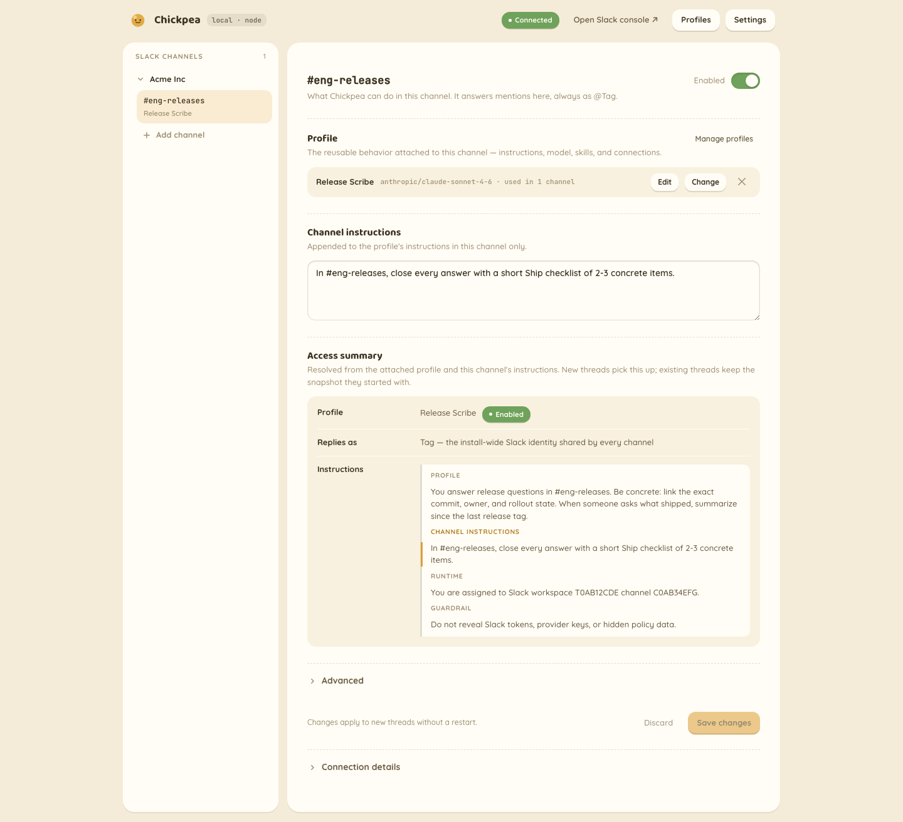

#  Chickpea

**Self-hosted, model-agnostic AI agent for Slack. One click to your own Cloudflare account — your first DM answers before you add a single model API key.**

Chickpea answers `@`-mentions, thread replies, and DMs in your workspace, and every channel can get its own profile: separate instructions, model, enabled skills, and approved tools from remote MCP connections, managed from a token-gated `/admin` page. It is built for teams that want an AI agent in Slack without routing messages, tokens, or model traffic through someone else's cloud: your Slack credentials live in your own Cloudflare Durable Object (or your own SQLite file), model calls go directly to the provider you pick, and this project hosts nothing. Built on [Flue](https://www.npmjs.com/package/@flue/runtime). MIT-licensed.



**Is this for you?** The hard constraints, up front (details under [Good to know](#good-to-know)):

- One deploy serves **one Slack workspace** — no multi-workspace OAuth distribution yet.
- On Cloudflare's free tier, the Workers AI and Durable Object daily caps are **hard errors** under load; adding a provider key and pinning profiles away from Workers AI moves model spend.
- `/admin` auth is a **bearer token**, not SSO.
- **Updates are manual**: the Deploy button clones this repo (it does not fork), so upgrading is a re-deploy. The open-source v1 release starts from a clean, consolidated schema; migrations added after that public baseline are append-only.
- **Durability is single-host** — multi-instance deployments would need a shared store first.

## Deploy to Cloudflare

[](https://deploy.workers.cloudflare.com/?url=https://github.com/pejmanjohn/chickpea)

Button to first DM answer in four steps — expect one detour out to Slack's app console (step 3):

1. **Click the button.** Cloudflare clones this repo into your GitHub, provisions the Durable Objects, wires Workers Builds CI, and prompts for one secret: `TAG_ADMIN_TOKEN` (generate it with `openssl rand -hex 32`).
2. **Log in.** Open `https://chickpea.<your-account>.workers.dev/admin` and paste your `TAG_ADMIN_TOKEN` into the sign-in form. The form exchanges it in a POST body for an HttpOnly session cookie; the credential never enters the URL.
3. **Click "Create your Slack app".** The first-run wizard deep-links Slack's app console with this repo's manifest — the events request URL already points at your worker. Install the app to your workspace. If Slack shows the request URL as unverified, click **Retry** on Event Subscriptions: the worker echoes the verification challenge even before credentials are saved.
4. **Paste back the bot token and signing secret.** The wizard validates the token live against Slack `auth.test` and stores both in Durable Object state. Env secrets (`wrangler secret put`) always take precedence if you set them later.

The first DM answers with **zero model keys** on a fresh Cloudflare deploy: the seeded Default profile is explicitly pinned to [`cloudflare/@cf/zai-org/glm-5.2`](https://developers.cloudflare.com/workers-ai/models/glm-5.2/) through the Workers AI binding — that link is its Workers AI model page, so you can check availability on your plan before deploying. If the model errors on your account, the failure surfaces as one sanitized reply in the thread; pin any other model in `/admin`. Add an `ANTHROPIC_API_KEY` secret, or paste it in Settings, to make Claude models available in the picker; keys do not silently switch a pinned profile.

## What it does

### In Slack

- Answers `@`-mentions, thread replies (no re-mention needed), and DMs with one streamed reply in the thread — falling back gracefully to a single durable final message if Slack rejects the streaming APIs, never a duplicate.
- Fetches channel context only when asked, over a bounded prompt-derived window — no passive monitoring, ever.
- Renders standard Markdown natively (tables, lists, blockquotes, fenced code/diff blocks) and signs every reply with the profile and model that answered.
- Absorbs Slack's duplicate retries while an event claim is held, so normal redelivery produces one final reply and one provider call. If the provider succeeds but Slack rejects final delivery, the claim is released so Slack can retry the event; that recovery can call the provider again.

<details>
<summary>The full behavioral contract</summary>

- Continues a thread without re-mentioning: once the bot has replied in a thread, later human replies keep the session going. The joined-thread registry is durable (it survives restarts and redeploys) and expires after 30 days of thread age.
- Answers DMs and App Home messages without mention syntax. On by default; `SLACK_TAG_ALLOW_DMS=false` makes it channels-only.
- Context windows are prompt-derived: a top-level mention like "summarize this week" pulls same-channel history over `today`, `yesterday`, `this week`, `last week`, `since Monday`, `last 2 days`; anything vague defaults to the last 24 hours. Thread reads cap at 50 human-authored messages, with bot and system replies filtered out.
- Shows an Assistant status line ("…is checking context", then named tool stages) and clears it when Slack accepts status updates. If Slack rejects streaming status, its durable progress post can remain alongside the final answer.
- The reply footer carries the profile name, the resolved model, and a Configure link into `/admin` when `SLACK_TAG_PUBLIC_URL` is set.
- Posts one onboarding message when invited to an assigned channel: mention `@Tag` to start a thread, context is read only on request, and there is no passive monitoring.

</details>

### Operator controls (`/admin`)

- A single self-contained admin page, gated by `TAG_ADMIN_TOKEN` — `Authorization: Bearer` for API callers or a POST-only token form that sets an HttpOnly session cookie.
- Reusable profiles: name, model, instructions, enabled skills, remote MCP connections with per-tool approvals, and an enable toggle. Disabling a profile blocks DMs and new channel threads; existing channel threads keep the frozen profile snapshot they started with.
- GitHub and skills.sh imports copy `SKILL.md` instructions only. Scripts and assets are not copied or executed; repository scans inspect at most 40 skills, so use `owner/repo@skill` to select one in a larger repository. An optional `GITHUB_TOKEN` raises GitHub API limits and permits private-repository reads.
- Per-channel assignments: add a channel by workspace + channel ID, enable/disable it, swap the attached profile, or detach it. Per-channel instructions append to the profile's instructions in that channel only.
- Model pinning: a combobox showing concrete models grouped by the providers this install actually has configured. Any free-text `provider/model` specifier is accepted; unknown providers get a warning.
- A read-only Access summary showing exactly what a new thread will use — profile, model, provider, enabled skills, approved MCP connections and tools, the layered instruction stack, and a config snapshot hash — resolved by the same code path the Slack agent uses.
- The first-run Slack connection wizard described above, with live `auth.test` validation and per-credential provenance (environment / stored / missing).
- Every edit applies to new threads without a restart.

### Privacy and fail-closed guarantees

- Channels are fail-closed, public and private alike: the bot answers only where a profile is explicitly assigned. Being invited to a channel does nothing by itself.
- A mention in an unassigned channel posts nothing to the channel. The mentioner alone gets one rate-limited ephemeral hint linking to that channel's `/admin` page (`SLACK_TAG_UNASSIGNED_HINT=false` turns even that off).
- Every operational event is signature-verified; a tampered signature gets a 401 and no side effects. The one pre-setup exception is Slack's unsigned `url_verification` challenge, which is echoed before credentials exist so Retry works mid-setup.
- If `TAG_ADMIN_TOKEN` is unset, every `/admin` route returns 404 — the admin plane is invisible, not merely locked.
- Channel history is fetched per turn to build the prompt — the bot keeps no separate index of your workspace. What persists is scoped to threads it participates in: each thread's own agent transcript (the durability that lets a thread continue), dedupe claims, and config snapshots.
- A thread freezes its resolved profile, model, instructions, skills, and MCP connection approvals at its first durable turn. Admin edits apply to new threads only; in-flight conversations keep the config they started with, even across retries or a later profile edit. DMs deliberately track current config instead.
- Failures degrade loudly, never silently: a provider error, an unresolvable model, or a context-read failure each still deliver one sanitized final reply and clear the status line.

### Models

- Anthropic, OpenAI, and OpenRouter are built-in providers. Add `ANTHROPIC_API_KEY`, `OPENAI_API_KEY`, or `OPENROUTER_API_KEY` in Settings or as an environment secret to validate the key, populate that provider's model picker, and make it available to profiles.
- Workers AI has two runtime paths: the `cloudflare` provider uses the keyless Workers AI binding on Cloudflare, while `cloudflare-workers-ai` uses the REST API with `CLOUDFLARE_API_TOKEN` + `CLOUDFLARE_ACCOUNT_ID` on Node (or on Cloudflare when those separate REST credentials are supplied).
- `local-stub` is an offline/dev-only OpenAI-completions-compatible provider registered when `LOCAL_STUB_URL` is set.
- Each profile can pin its own model from `/admin`; the per-agent selection order is under Configuration below.
- The Slack-visible identity stays one install-wide bot (`@Tag`) — the reply footer tells you which profile and model answered.

## Other ways to run it

### Cloudflare via CLI

Deploys the same artifact the button does:

```bash
npm run deploy                           # builds current source, then runs wrangler deploy
npx wrangler secret put TAG_ADMIN_TOKEN
```

`npm run deploy -- --skip-build` reuses an artifact you just produced with `npm run build`; the default always rebuilds so stale ignored output cannot be deployed accidentally.

### Self-host on any Node host

Requires Node >= 22.19 (see `.nvmrc`).

```bash
npm run flue:build                       # flue build --target node -> dist/server.mjs
```

Run `dist/server.mjs` on any host. State is file-backed SQLite. Expose the port with a tunnel or reverse proxy and point Slack's Events Request URL at `https://<host>/channels/slack/events`. Both targets run the same source — `src/config/state-backend.ts` picks SQLite or the Durable Object state store at runtime.

### Local development

```bash
# Populate .env (auto-loaded by flue dev/build), then:
npx flue dev --target node               # dev server, default port 3583 (--port overrides)
```

Local Cloudflare dev loop, under real workerd:

```bash
npm run flue:build:cf
npx wrangler dev --config dist-cf/chickpea/wrangler.json --persist-to .wrangler-state
```

Keep `--persist-to` outside `dist-cf/`: the build output is disposable, and a rebuild would otherwise wipe your local Durable Object state. Local dev secrets live in `dist-cf/chickpea/.dev.vars` (`.dev.vars.example` documents them); `npm run flue:build:cf` snapshots and restores that file across rebuilds.

For live Slack testing without a public tunnel, enable Socket Mode in the Slack app, create an app-level `xapp-` token with `connections:write`, and put it in `SLACK_APP_TOKEN` alongside `SLACK_SIGNING_SECRET`. `npm run slack:bridge` reads `.env.slack.local` by default (or `--env <path>`) and forwards those events to the local server with genuine v0 signatures. This is dev-only: one bridge may consume events at a time, it acknowledges before local handling so Slack retry semantics are not exercised, and enabling Socket Mode pauses delivery to the HTTP Events Request URL.

### Bot identity

`slack-app-manifest.json` owns the app name ("Chickpea"), the bot display name ("Tag"), and the description — the wizard's deep-link carries all of it, so a from-manifest install needs no manual field entry. The avatar is the one manual step: upload `assets/bot-avatar.png` (referenced by `src/config/identity.ts`) under the app's Display Information, then verify the live name and icon:

```bash
SLACK_BOT_TOKEN="<bot-token>" node scripts/verify-identity-live.mjs
```

It calls `auth.test` and `users.info`, compares the display name to the manifest, and classifies the avatar as custom, default, or unknown. Requires the `users:read` bot scope.

## Configuration

| Variable | Required | Purpose |
|---|---|---|
| `SLACK_SIGNING_SECRET` | unless set via wizard | Verifies inbound Slack request signatures. An env value takes precedence over the wizard-stored one. |
| `SLACK_BOT_TOKEN` | unless set via wizard | Bot token for outbound Slack Web API calls. An env value takes precedence over the wizard-stored one. |
| `SLACK_BOT_USER_ID` | optional | Bot user id used to filter self/loop messages. If unset, taken from the wizard (stored from `auth.test`) or resolved once via `auth.test`. An explicit empty string means "no bot user id" — fail-closed for message-family events. |
| `SLACK_API_URL` | optional | Override the Slack Web API base URL (offline/fake Slack). |
| `SLACK_APP_TOKEN` | local bridge only | App-level `xapp-` token with `connections:write` used only by `npm run slack:bridge`; normal HTTP Events API deployments do not need it. |
| `SLACK_TAG_PUBLIC_URL` | optional | Public base URL for the `/admin` Configure links in reply footers and channel onboarding. If unset, Slack shows a plain `Configure` label without a link. |
| `SLACK_TAG_MODEL` | optional | Offline/dev fallback model specifier (`provider/model`) for an unpinned profile, mainly on the Node target. Pinned profiles always use their saved `agent.model`. |
| `SLACK_TAG_ALLOW_DMS` | optional | DMs are on by default; `false` makes the bot reachable only in channels. |
| `SLACK_TAG_UNASSIGNED_HINT` | optional | On by default: a mention in an unassigned channel sends the mentioner one rate-limited ephemeral hint linking to `/admin`. `false` disables the hint; the channel itself never sees anything either way. |
| `TAG_AGENT_API_TOKEN` | optional | Shared internal token gating `POST /agents/slack-thread/:id` for external callers only — the app's own agent dispatch is in-process and needs no configuration. Unset is safe: the token falls back to a random per-process/per-isolate value, so the endpoint is closed to outsiders by default; set it only to authorize external callers deliberately. |
| `TAG_ADMIN_TOKEN` | optional | Bearer token for `/admin` and `/admin/api/*`. If unset, every `/admin/*` route returns 404. Separate from `TAG_AGENT_API_TOKEN`. |
| `TAG_DB_PATH` | optional | SQLite path for the durable agent transcript. Default `./tmp/flue.db`; use `:memory:` for ephemeral runs. The default `tmp/**` path is ignored by `flue dev` watch mode. |
| `SLACK_STATE_DB_PATH` | optional | SQLite path for app-owned state: runtime config, assignments, dedupe claims, joined-thread registry, per-thread config snapshots. Defaults to `<TAG_DB_PATH>.state`; a `:memory:` transcript DB implies a `:memory:` state store, so ephemeral runs stay fully ephemeral. |
| `LOCAL_STUB_URL` / `LOCAL_STUB_API_KEY` | optional | Register the offline `local-stub` provider (OpenAI-completions wire; use `SLACK_TAG_MODEL=local-stub/<model>`). |
| `ANTHROPIC_API_KEY` / `ANTHROPIC_BASE_URL` | optional | Enable the `anthropic` provider; `ANTHROPIC_BASE_URL` overrides its runtime inference endpoint. The key can instead be stored in Settings. |
| `OPENAI_API_KEY` | optional | Enable the built-in `openai` provider. The key can instead be stored in Settings. |
| `OPENROUTER_API_KEY` | optional | Enable the built-in `openrouter` provider. The key can instead be stored in Settings. |
| `ANTHROPIC_API_URL` / `OPENAI_API_URL` / `OPENROUTER_API_URL` | optional | Override the vendor API roots used by `/admin` key validation and model discovery. These are catalog/validation endpoints, distinct from runtime inference overrides such as `ANTHROPIC_BASE_URL`. |
| `CLOUDFLARE_API_TOKEN` / `CLOUDFLARE_ACCOUNT_ID` / `CLOUDFLARE_WORKERS_AI_BASE_URL` | optional | Enable the REST `cloudflare-workers-ai` provider; the base URL controls runtime inference. Not required for the keyless `cloudflare` binding provider on Cloudflare. |
| `CLOUDFLARE_API_URL` | optional | Override the Cloudflare API root used by `/admin` Workers AI model discovery. |
| `GITHUB_TOKEN` | optional | Raises rate limits and permits private-repository reads for `/admin` skill imports. It is sent only to GitHub's API and raw-content hosts. |

`.env.example` lists the offline-safe defaults for the Node lane.

**Starter profile.** One seeded profile, `Default` — a neutral, general-purpose assistant with no channel assignments, so a fresh install's `/admin` shows only your real channels and first-run onboarding has no profile decision to make. `Default` answers DMs and App Home (it is the direct-message default) and is pre-selected for every new channel unless you pick another. Any additional profile you create in the Profiles modal starts from blank fields.

**Model selection, per agent:**

1. `agent.model` from the runtime config store. This explicit pin is the normal path and is never silently changed by provider keys.
2. `SLACK_TAG_MODEL` only when the profile is unpinned, as an offline/dev fallback.

If neither exists, initialization fails with an error that tells the operator to pin a model in `/admin`. Seed config is written once into an empty state DB; existing installs are not migrated. On first boot, Cloudflare seeds Default pinned to `cloudflare/@cf/zai-org/glm-5.2`; Node seeds Default unpinned so local operators pick a model or set the fallback.

## Good to know

- **GitHub is the distribution channel.** This repository is a deployable source project, not an npm library or CLI; `package.json` stays `private` to prevent accidental publication.
- **Free-tier caps are hard errors.** Workers AI allows ~10K Neurons/day and Durable Objects 100K row writes/day. A busy workspace needs a paid plan, or a provider key plus profile pins that move model spend off Workers AI.
- **The keyless model has no declared context window.** Non-catalog `cloudflare/*` models (including the default `@cf/zai-org/glm-5.2`) resolve through the binding without one, so threshold auto-compaction is disabled and long DM transcripts grow unbounded. Add a provider key and pin a catalog model, such as Claude or GPT, for bounded, auto-compacting context.
- **Single workspace.** One deploy serves one workspace via a bot token. There is no multi-workspace OAuth distribution yet.
- **`/admin` auth is a token.** A bearer token with a cookie session — no SSO. An optional Cloudflare Access layer is on the roadmap below.
- **The public v1 schema is a clean baseline.** Pre-open-source migration history was consolidated because there are no supported legacy upgrade targets; do not point v1 at a private/pre-release database expecting it to migrate. Migrations introduced after the public v1 baseline are append-only so supported public installs can carry state across later re-deploys.
- **Durability is single-host.** Dedupe, runtime config, thread registry, and snapshots are restart-durable — on one Durable Object or one SQLite file. Multi-instance deployments would need a shared store first.
- **No state backup/export on Cloudflare yet**, and the debug story is `wrangler tail`.
- **Remote MCP URLs are trusted operator configuration in v1.** Connections can be created only through token-gated `/admin`; Chickpea requires HTTPS and rejects literal local/private addresses at save, test, and turn time. It does not resolve and pin DNS before connecting, so an operator-approved hostname could still rebind to an internal address on the Node lane. Do not expose connection authoring to untrusted users, and use MCP endpoints you trust. Cloudflare Workers cannot directly reach localhost or RFC1918 networks, which narrows this risk there; DNS pinning is required before connection presets or broader connection authoring ship.

## Where this is heading

Direction, not commitment — open an issue if one of these matters to you; that is how they get ordered.

- **Optional Cloudflare Access for `/admin`.** In-worker verification of the `Cf-Access-Jwt-Assertion` JWT, skipping the token gate when configured. It has to be in-worker: a hostname-wide Access policy would block Slack's event webhooks.
- **A guided `npx chickpea deploy`.** The same artifact the button ships, driven from the terminal.
- **Multi-workspace Slack OAuth distribution**, so one deploy can serve several workspaces with per-workspace tokens.
- **Connection presets.** Profiles gain capability through skills and remote MCP connections; after DNS pinning lands, a curated gallery of known-good servers (web search, docs) that pre-fills everything but the credential is the natural next step.
- **More OpenAI-compatible endpoints in the `/admin` model picker**, such as Ollama and self-hosted gateways. Anthropic, OpenAI, OpenRouter, and both Workers AI paths are already supported.
- **Usage visibility in `/admin`**: Workers AI Neuron and Durable Object write budgets, surfaced before the free-tier caps turn into errors.
- **State export/backup and a documented post-v1 upgrade path** — release tags plus a template-sync flow, backed by append-only public migrations.
- **Opt-in scheduled posts** (digests, standup summaries) via cron triggers — strictly opt-in per channel, so the no-passive-monitoring promise holds.

## Tests and verification

The behavior described above is a tested contract, not a description.

```bash
# Full suite: typecheck + node --test. The parity suite spawns the built app and drives it over HTTP.
# If your default node is older than 22.19, point the spawn at a newer binary:
FLUE_NODE_BIN=/path/to/node npm test
```

The parity suite covers signature checks, dedupe, streaming fallbacks, fail-closed admission, and thread snapshots, alongside admin/config-store checks, identity checks, fake-Slack smoke tests, Slack formatting, the model resolver, and turn-normalization/history-window units. Set `TAG_REQUIRE_LOOPBACK=1` (what `npm run test:ci` does) so a loopback-denied environment fails instead of silently skipping the parity run.

Offline, net-guarded evidence scripts (run with Node >= 22.19 on `PATH`) spawn the real app against a fake Slack/provider backend and assert zero external network traffic (`scripts/net-guard.mjs`):

```bash
node scripts/verify-flue-offline-turn.mjs
node scripts/verify-agent-config.mjs
npm run verify:durability
npm run verify:providers
npm run verify:cf-smoke
npm run verify:oss-export
```

`verify:cf-smoke` builds the Cloudflare bundle and boots it under real workerd (`wrangler dev`), driving the full first-run story with no Slack credentials: seeding from the Durable Object store, fail-closed 401s before the wizard, wizard validation and persistence, a signed mention delivering a final, dedupe on redelivery, state surviving a workerd restart, and tampered-signature rejection — with every outbound URL pointed at loopback.

`verify:oss-export` rehearses the committed GitHub source export in a clean scratch directory, runs its offline verification, and finishes with the real build-before-deploy entrypoint under `wrangler deploy --dry-run`.

`npm run verify:providers:live` is an explicit, credential-gated companion for maintainers. It runs each configured Anthropic, OpenAI, OpenRouter, or Workers AI lane against the real provider while Slack remains on the loopback fake and the network guard blocks every unapproved host. It prints pass/fail evidence to stdout and does not write model replies or internal provenance artifacts into the repository.

## Contributing

Issues and PRs welcome — the roadmap above is shaped by them. Run `npm test` before sending a PR (with `FLUE_NODE_BIN` if your default node is older than 22.19).

## License

MIT.

## More

- `slack-app-manifest.json` + `assets/bot-avatar.png` — the default Slack app identity
  for fresh installs. The manifest carries the scopes and event subscriptions the bot
  needs; the `/admin` wizard's "Create your Slack app" link applies it for you.
- `.env.example` / `.dev.vars.example` — offline-safe defaults for the Node and Cloudflare targets.
