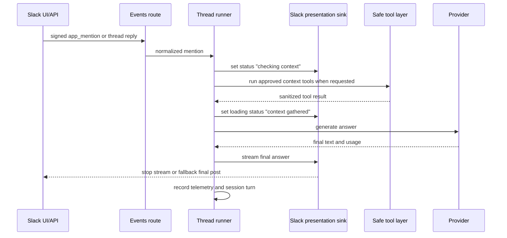
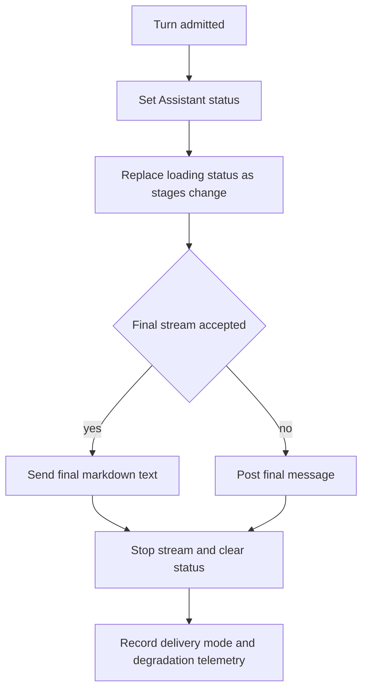

# Slack Assistant UX - Plan

## Goal Capsule

| Field | Value |
|---|---|
| Objective | Upgrade the Slack Flue prototype from ordinary threaded progress/final posts to a Claude-like Slack experience with Assistant status, transient safe loading text, streamed replies, Slack app configuration, and live UI proof. |
| Authority | Slack Web API and Agents & AI Apps behavior are the integration contract; app-owned assignment, dedupe, session snapshots, provider selection, and policy remain the product authority. |
| Execution profile | Standard feature slice with external API behavior, live Slack app configuration, and Computer Use assisted verification. |
| Stop conditions | Stop before changing Slack app settings if the operator cannot confirm the permission change, before transmitting secrets into chat/docs/logs, or if Slack API behavior differs from the documented status/stream contract. |
| Tail ownership | Implementation owns code, tests, docs, Slack app configuration, and a live evidence packet showing the richer Slack behavior in the Paperplane Labs playtest workspace. |

---

## Product Contract

### Summary

This plan adds a Slack presentation layer that makes the agent visibly work in Slack: status text appears immediately, safe progress updates render during execution, and the final answer streams or gracefully falls back to a normal thread reply.
The slice also configures the Slack app through Computer Use and captures live proof, while preserving the existing app-owned agent/session architecture.

### Problem Frame

The current prototype proves a real Slack loop, but Slack only sees a normal progress message followed by a final `chat.postMessage` reply.
Claude's Slack app feels richer because Slack itself renders an Assistant status/loading state and a streaming progress timeline while the agent works.
The missing work is not only code: the Slack app must have the right Agents & AI Apps configuration, the bot must call Slack's Assistant and streaming APIs, and the final proof must come from the real Slack UI rather than fixture output.
Slack-owned visual chrome, including the purple app-name flash seen in the reference video, is not directly configurable by bot code; the controllable work is enabling the AI app surface and sending Assistant status/loading-message events plus final stream events that Slack may render with that chrome.

### Requirements

**Slack user experience**

- R1. A Slack mention or thread reply must show an immediate visible working state before provider or tool latency dominates the turn.
- R2. The app must update Slack with short, safe progress stages such as checking context, gathering information, calling approved tools, and composing the answer.
- R3. The final assistant answer must prefer Slack's streaming message APIs and fall back to a normal final thread reply when streaming is unavailable or rejected.
- R4. Visible progress must never expose raw model chain-of-thought, provider reasoning text, prompts, secrets, bearer tokens, request bodies, or raw external tool payloads.

**Slack app configuration**

- R5. The Paperplane Labs Slack app must be configured for the documented AI app surface needed for Assistant status and streaming, including the required scopes and event subscriptions.
- R6. Slack app setting and permission changes made through Computer Use must receive action-time user confirmation before the persistent UI-side change is applied.
- R7. The implementation must keep existing `app_mention` behavior working in channels, even if richer Assistant container events are enabled.

**Architecture and operations**

- R8. Slack status and streaming are presentation concerns; assignment resolution, dedupe, sessions, tool allowlists, telemetry, and provider selection remain app-owned.
- R9. Slack Web API failures must be bounded and observable: status/stream failures should not prevent a final answer, but failed final delivery should still surface as a handled error.
- R10. Tests must prove the Slack Web API call sequence with fake fetch responses before any live Slack canary is trusted.
- R11. Live verification must produce evidence from the real Slack UI showing status/loading behavior, transient loading text, and final response delivery.
- R12. The implementation and docs must distinguish app-controlled behavior from Slack-owned visual chrome, especially the purple app-name animation.
- R13. Streaming calls must carry the Slack recipient fields required by the Web API, using the normalized workspace and user identifiers already available from signed Slack events.

### Acceptance Examples

- AE1. Given a user mentions the bot in the Paperplane Labs playtest channel, when the local server receives the event, then Slack displays a working status before the final answer is posted.
- AE2. Given the message asks for channel context, when the approved safe tool runs, then Slack shows safe transient Assistant loading/status text for context gathering without adding permanent progress lines or exposing raw tool payloads.
- AE3. Given Slack accepts streaming APIs, when the model response is available, then the final answer is delivered through a stream and stopped cleanly.
- AE4. Given Slack rejects or rate-limits a streaming call, when the turn still produces model text, then the app falls back to a single final thread reply and records the degradation in telemetry.
- AE5. Given Computer Use is about to enable Agents & AI Apps or add scopes, when the next UI action would persist that change, then the agent asks for confirmation before clicking through.

### Scope Boundaries

In scope:

- Status updates with `assistant.threads.setStatus` and fixed `loading_messages`.
- Streaming final replies with `chat.startStream` and `chat.stopStream`.
- Safe transient progress text derived from application/tool lifecycle events.
- Slack app configuration and live UI proof through Computer Use.
- Docs and decision evidence for the new Slack presentation behavior.

Out of scope:

- Raw chain-of-thought or provider reasoning disclosure in Slack.
- Broad adoption of `@flue/slack` as the ingress adapter.
- Durable database-backed sessions or dedupe.
- Full Claude Tag parity such as repository search, access bundles, "Open session" web handoff, app Home customization, suggested prompts, thread titles, and guest policy.
- Production deployment beyond the current local/tunnel playtest path.
- Direct control over Slack-owned visual styling such as the purple app-name flash, exact loading animation, or client-specific animation timing.

#### Deferred to Follow-Up Work

- Persist dedupe/session state and connect the Slack playtest to a deployed Cloudflare Worker after the local UX canary is proven.
- Add richer Assistant container handling such as suggested prompts and thread titles if the app-specific DM experience becomes a priority.
- Consider `@slack/web-api` only if its `chatStream()` helper materially reduces complexity after the direct fetch-backed Web API path is proven.

---

## Planning Contract

### Key Technical Decisions

- KTD1. Keep the Slack adapter app-owned. The current route already verifies signatures, resolves assignments, claims dedupe, and calls a fetch-backed reply sink; richer Slack UX should extend that seam instead of switching to `@flue/slack` while that package remains beta for this prototype.
- KTD2. Add a presentation sink rather than making the model post progress. The runner should emit semantic lifecycle events, and trusted code should translate those events into Assistant status/loading-message calls plus final message calls.
- KTD3. Use direct Web API calls first. The repo already tests Slack behavior by injecting `fetch`, and direct `assistant.threads.setStatus` plus streaming method calls preserve the current Cloudflare-compatible seam without adding `@slack/web-api`.
- KTD4. Treat streaming as preferred but optional. Slack status and stream errors degrade to ordinary final posting so user-visible delivery remains reliable during beta API or permission churn.
- KTD5. Visible traces are sanitized operational traces. They describe what the app is doing, not how the model reasoned internally.
- KTD6. Computer Use is part of verification, not a hidden side effect. The executor should inspect and operate the Slack/admin UI with Computer Use, ask before persistent permission changes, then capture screenshot or video evidence from Slack.
- KTD7. Finish every visible working state. Slack status has a documented timeout and is automatically cleared by replies, but the app should still clear status or stop the stream on success, provider failure, and fallback paths so Slack does not appear stuck.
- KTD8. Treat Slack visual chrome as a verified outcome, not a programmable contract. Code can call Slack status and streaming APIs; Computer Use must verify what the Slack client actually renders.

### High-Level Technical Design

### Agent-Native Planning Notes

This work is agent-native by definition: it changes how a Slack agent exposes work-in-progress state to humans.
The safe parity rule is that any visible trace an agent emits must be derived from trusted runtime/tool lifecycle events and must be suitable for a user to read in a shared Slack thread.
Computer Use belongs in the verification lifecycle because the critical proof is not only API success, but the real Slack UI rendering the working state.

### Risks and Dependencies

| Risk | Mitigation |
|---|---|
| Slack AI app settings or scopes differ from docs or workspace policy. | Use Computer Use to inspect the real app settings, ask before permission changes, and record exact final configuration in the decision doc. |
| Status calls succeed but do not render in the channel/thread surface being tested. | Verify both API response sequence and Slack UI evidence; record surface-specific behavior as a caveat if Slack only renders status in Assistant app threads. |
| The purple app-name flash is assumed to be configurable. | Document that this is Slack-owned UI chrome and verify whether enabling the AI app surface plus status updates produces it in the tested client. |
| Streaming APIs reject parameters in channel threads or require recipient identifiers. | Pass recipient user and team identifiers from the normalized Slack event into stream start calls, cover missing-field cases in fake API tests, capture response errors, and preserve the existing channel mention path. |
| Progress traces leak implementation detail. | Restrict progress text to a fixed allowlist of sanitized stage labels, and test that raw prompts, request bodies, tokens, and tool payload strings are not posted. |
| Computer Use performs a persistent Slack admin change without consent. | Follow the Computer Use confirmation policy and pause immediately before UI actions that add scopes, enable AI app settings, or reinstall the app. |

### Sources and Research

- `docs/START_HERE.md` establishes the prototype goal: Slack is an assignment surface, while assignment, policy, billing, audit, and secrets stay app-owned.
- `docs/decisions/2026-06-29-slack-flue-vertical-slice-decision.md` shows the current proof: signed Slack route, app-owned dedupe, `chat.postMessage` progress/final replies, and live Paperplane Labs playtest.
- `docs/source/claude-tag/2026-06-26-claude-tag-research.md` defines the product target: Claude posts progress before final results and keeps Slack threads as the user-visible artifact.
- [Flue Slack docs](https://flueframework.com/docs/ecosystem/channels/slack/) state that Assistant status and streaming are Slack Web API behavior rather than `@flue/slack` behavior, and show `assistant.threads.setStatus` plus `chatStream()` as the intended outbound pattern.
- [Slack agent docs](https://docs.slack.dev/ai/developing-agents/) state that Agents & AI Apps must be enabled for the app, status should be set immediately, status can be cleared with an empty string, and text streaming uses `chat.startStream`, `chat.appendStream`, and `chat.stopStream`.
- Slack method docs document the direct Web API methods, required fields, `loading_messages`, and the two-minute timeout behavior for status: [`assistant.threads.setStatus`](https://docs.slack.dev/reference/methods/assistant.threads.setStatus/), [`chat.startStream`](https://docs.slack.dev/reference/methods/chat.startStream/), [`chat.appendStream`](https://docs.slack.dev/reference/methods/chat.appendStream/), and [`chat.stopStream`](https://docs.slack.dev/reference/methods/chat.stopStream/).

---

## Implementation Units

### U1. Slack Presentation Sink Contract

**Goal:** Add a trusted Slack presentation interface that can set Assistant status/loading messages, start/stop final-answer streams, and fall back to normal posts.

**Requirements:** R1, R2, R3, R4, R8, R9, R10, R13, AE1, AE2, AE3, AE4.

**Dependencies:** None.

**Files:**

- `src/slack/replies.ts`
- `src/slack/web-api-replies.ts`
- `tests/slack-presentation.test.ts`
- `tests/slack-events-route.test.ts`

**Approach:** Keep `LocalSlackReplySink` simple but extend the interface around presentation events, not just final posts.
The Web API implementation should use injected `fetch` for all Slack calls and normalize Slack responses into explicit delivery results such as status-set, stream-started, stream-stopped, status-cleared, post-fallback, and failed.
Stream start payloads should include the recipient user and team identifiers from the normalized Slack event when Slack requires them for channel-thread streaming.
Progress must use Assistant status/loading messages instead of stream `task_update` chunks because Slack renders stream chunks as durable message content in channel threads.
Status/stream failures should return degradation data to the runner instead of throwing until final delivery is impossible.

**Patterns to follow:** Existing `SlackWebApiReplySink` fetch injection, `tests/slack-events-route.test.ts` fake Slack API responses, and `LocalSlackReplySink` posts array for deterministic fixture tests.

**Test scenarios:**

1. Happy path: given a turn starts, when the presentation sink receives status and stream operations, then fake fetch observes calls to `assistant.threads.setStatus`, `chat.startStream`, and `chat.stopStream` with the original channel, thread timestamp, recipient user id, and recipient team id.
2. Happy path: given a safe progress label, when the sink reports progress, then fake fetch receives fixed `loading_messages` on `assistant.threads.setStatus` and no stream `chunks`.
3. Edge case: given `assistant.threads.setStatus` returns a Slack `ok: false` response, when final text is available, then the sink still attempts final delivery and returns a degradation marker.
4. Error path: given stream start returns `ok: false`, when final text exists, then the sink posts one final fallback message and does not attempt append/stop on a missing stream.
5. Error path: given final fallback post fails, when no stream was completed, then the sink throws a final-delivery error with sanitized Slack error text.
6. Safety path: given candidate progress text includes prompt-like, token-like, or raw payload-like values, when the sink serializes it, then only allowlisted stage labels are posted.
7. Cleanup path: given status was set and the stream completes or falls back, when final delivery finishes, then the sink records a status-cleared or stream-stopped result.
8. Missing-field path: given a normalized mention lacks a recipient field required by Slack streaming, when final text exists, then the sink skips stream start, records the degradation, and posts a normal final thread reply.

**Verification:** Unit tests prove direct Slack Web API calls and degradation behavior without contacting Slack.

### U2. Runner Progress Lifecycle

**Goal:** Make `handleSlackAppMention` drive the new presentation lifecycle while preserving dedupe, session snapshots, provider lanes, and current final-result semantics.

**Requirements:** R1, R2, R3, R4, R7, R8, R9, R10, R13, AE1, AE2, AE4.

**Dependencies:** U1.

**Files:**

- `src/runtime/slack-thread-runner.ts`
- `src/runtime/telemetry.ts`
- `tests/slack-thread-runner.test.ts`
- `tests/slack-presentation.test.ts`

**Approach:** Replace the single progress post with a lifecycle: admitted, checking context, approved tool started, approved tool completed, model generating, final delivering, final delivered, and cleanup.
Each stage should be represented by a stable internal enum or equivalent structured value and mapped to user-safe Slack text in trusted code.
The runner should keep the duplicate-event path side-effect-free, pass the normalized Slack workspace and user ids into stream start, and record first visible response kind as status or stream when richer presentation succeeds.

**Patterns to follow:** Current duplicate claim before provider/tool work, `collectAllowedToolResults`, deterministic provider lanes, and `TelemetryStore` append-only records.

**Test scenarios:**

1. Happy path: given a normal mention, when the runner handles it, then presentation records status before tool or provider work and records a final delivery after provider text.
2. Covers AE2. Given the mention includes `channel context`, when the approved tool runs, then presentation records a safe context-gathering Assistant status/loading-message update and the final answer includes only sanitized tool-derived context.
3. Edge case: given a duplicate Slack event id, when the runner handles the retry, then it does not set status, start a stream, run tools, or call the provider a second time.
4. Error path: given the provider throws after status succeeds, when the runner handles the error, then it posts a final sanitized failure message and clears or ends the working state.
5. Degradation path: given the presentation sink reports status/stream degradation, when the final post succeeds, then telemetry records degraded delivery without failing the whole turn.
6. Safety path: given provider output contains a malformed reasoning tag or secret-like marker, when progress updates are emitted, then progress updates remain from the fixed safe label set rather than provider output.
7. Cleanup path: given any non-duplicate turn reaches a terminal state, when the runner finishes, then it has attempted to stop the stream or clear status exactly once.

**Verification:** Runner tests prove ordering, no duplicate side effects, sanitized progress, fallback behavior, and updated telemetry.

### U3. Slack Assistant Event and Configuration Surface

**Goal:** Prepare the app for Slack's Agents & AI Apps surface without breaking the existing channel mention route.

**Requirements:** R5, R7, R8, R9, R10.

**Dependencies:** U1.

**Files:**

- `src/slack/types.ts`
- `src/slack/events-app.ts`
- `tests/slack-events-route.test.ts`
- `fixtures/slack/assistant-thread-started.json`
- `docs/play-slack.md`

**Approach:** Keep `app_mention` as the execution trigger for this slice, but make the route safely acknowledge Assistant-specific events that Slack may send after enabling Agents & AI Apps.
The route should not start model work for Assistant container events unless a later unit explicitly defines that behavior.
Docs should list the exact Slack configuration to inspect: Agents & AI Apps enabled, bot scopes including `chat:write` and Assistant capability scope where Slack requires it, and event subscriptions for `app_mention` plus Assistant events required by the Slack setting.

**Patterns to follow:** Existing URL verification handling, existing ignored-event response shape, and signed request tests.

**Test scenarios:**

1. Happy path: given `assistant_thread_started`, when Slack posts the signed event, then the route returns `ok: true` without calling the provider or posting Slack messages.
2. Happy path: given `assistant_thread_context_changed`, when Slack posts the signed event, then the route returns `ok: true` without changing existing app-mention behavior.
3. Regression path: given an `app_mention` after Assistant events are added, when the route handles it, then the existing progress/final behavior still executes.
4. Error path: given an Assistant event with an invalid Slack signature, when the route handles it, then the existing invalid-signature response still applies.

**Verification:** Route tests prove enabling Assistant events does not create accidental model work and does not regress app mentions.

### U4. Slack App Configuration Through Computer Use

**Goal:** Configure the real Slack app for the richer AI surface and document the exact confirmed settings without exposing secrets.

**Requirements:** R5, R6, R7, R11, R12, AE5.

**Dependencies:** U1, U2, U3.

**Files:**

- `docs/play-slack.md`
- `docs/decisions/2026-06-29-slack-assistant-ux-decision.md`

**Approach:** Use Computer Use to inspect the Slack app admin UI and Slack client UI.
Before clicking any UI control that enables Agents & AI Apps, adds scopes, reinstalls the app, or changes event subscriptions, the executor must pause for action-time confirmation because those are persistent permission/configuration changes.
The decision doc should record the final app name, workspace, bot scopes, subscribed events, request URL shape, and whether Slack required reinstall approval.

**Patterns to follow:** Current `docs/play-slack.md` playtest instructions and the existing vertical-slice decision evidence style.

**Test scenarios:**

1. Manual verification: given Computer Use opens the Slack app settings, when the executor reaches a persistent permission change, then the executor asks for confirmation before applying it.
2. Manual verification: given the app is configured, when the executor returns to app settings, then the documented scopes and subscribed events match the plan.
3. Safety verification: given app settings display signing secret, bot token, or OAuth token values, when evidence is captured, then screenshots and docs exclude or redact those values.

**Verification:** The decision doc contains non-secret configuration evidence and states where Computer Use confirmation was required.

### U5. Live Slack UX Canary

**Goal:** Prove the richer Slack behavior in the real Slack UI and capture evidence suitable for deciding whether this UX is ready for the next prototype slice.

**Requirements:** R1, R2, R3, R4, R7, R9, R11, R12, AE1, AE2, AE3, AE4.

**Dependencies:** U1, U2, U3, U4.

**Files:**

- `docs/play-slack.md`
- `docs/decisions/2026-06-29-slack-assistant-ux-decision.md`
- `tests/slack-presentation.test.ts`
- `tests/slack-thread-runner.test.ts`

**Approach:** Run the local Slack server and tunnel using the existing playtest pattern, then use Computer Use to send a real Slack mention in the Paperplane Labs playtest channel.
The canary should use a message that triggers channel context so both transient loading/status behavior and final response delivery are visible.
Evidence should include a screenshot or video frame showing the working status/progress and the final thread result.
If Slack renders status only in Assistant app threads and not channel mention threads, record that as a product caveat rather than masking it with API-only proof.

**Patterns to follow:** Existing live proof style in `docs/decisions/2026-06-29-slack-flue-vertical-slice-decision.md`, including exact command results and caveats.

**Test scenarios:**

1. Live happy path: given the Paperplane Labs app is configured and the local route is tunneled, when a user mentions the bot in the playtest channel, then Slack visibly shows status/progress before the final answer.
2. Live tool path: given the mention asks for channel context, when the tool runs, then Slack shows safe transient loading/status text and the final answer references the configured channel brief.
3. Live fallback path: given streaming is disabled or rejected through a controlled fake Slack API test, when the model response exists, then fallback final posting still succeeds.
4. Evidence path: given screenshots or video are captured, when the decision doc is written, then it references only non-secret evidence and states whether status/loading messages, streaming, and fallback were proven.

**Verification:** The live canary evidence shows real Slack UI behavior, and the decision doc records any Slack-surface caveats.

---

## Verification Contract

| Gate | Applies to | Done signal |
|---|---|---|
| `npm test` | U1, U2, U3, U5 | Typecheck and Node tests pass, including Slack presentation sequencing and fallback tests. |
| `npm run flue:build` | U1, U2, U3 | Flue Cloudflare target still builds after the Slack presentation additions. |
| Fake Slack API response tests | U1, U2, U3 | Tests cover status success/failure, stream success/failure, fallback final post, duplicate retry behavior, and Assistant event acknowledgement. |
| Working-state cleanup tests | U1, U2 | Tests cover status clear or stream stop on success, provider failure, and fallback paths. |
| Computer Use Slack app inspection | U4 | Final app settings match docs, and any permission changes were confirmed before UI submission. |
| Live Slack canary | U5 | Real Slack UI evidence shows working status/progress and final delivery, or records a precise Slack-surface limitation. |
| Redaction check | U4, U5 | Docs, screenshots, logs, and test fixtures contain no Slack tokens, signing secrets, provider keys, bearer tokens, or raw prompt/request bodies. |

---

## Definition of Done

- All implementation units are complete in dependency order.
- Slack presentation tests prove direct Web API status/stream/fallback behavior without contacting Slack.
- Terminal success and failure paths stop the stream or clear Slack status so the app does not appear stuck working.
- Existing app mention, dedupe, provider lane, and safe tool tests still pass.
- The Slack app is configured through Computer Use with action-time confirmation for persistent settings or permission changes.
- A live Paperplane Labs Slack canary shows the richer UX or records the exact Slack limitation preventing it.
- `docs/play-slack.md` reflects the new configuration and canary procedure without secrets.
- `docs/decisions/2026-06-29-slack-assistant-ux-decision.md` records evidence, caveats, and the continue/pivot decision.
- Abandoned implementation experiments and unused helper paths are removed before declaring the plan done.
