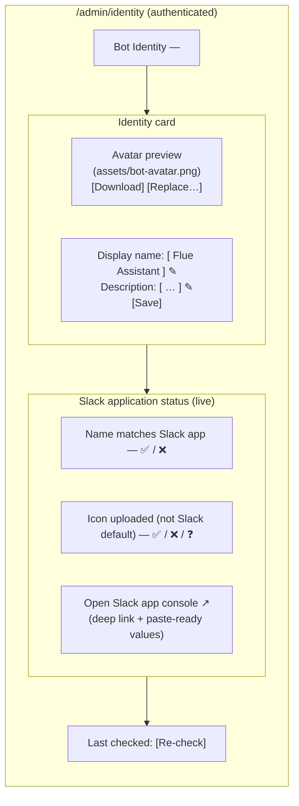
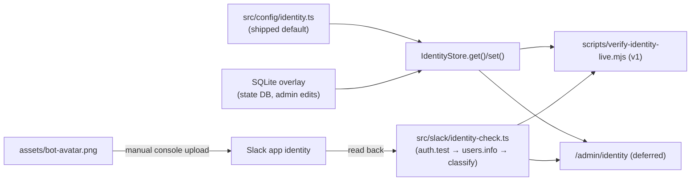

# Bot Identity - Architecture

Implements the product contract in [2026-07-02-001-feat-bot-identity-plan.md](./2026-07-02-001-feat-bot-identity-plan.md). Product scope is locked there; this document decides shape, files, verification mechanics, and sequencing.

## Decisions at a glance

- **Identity lives in `src/config/` as one seeded object behind a store accessor** (`IdentityStore.get()`), mirroring the existing `AgentStore`/`AssignmentStore` pattern in `src/config/resolver.ts`. No consumer imports the constant directly — that accessor is the admin-UI seam.
- **The message path does not change.** `src/slack/web-client-presenter.ts` stays identity-free by design: parity comes from the real Slack app identity (locked decision), and `chat.startStream` / Assistant surfaces render the app identity, not per-message overrides. The config is consumed by the setup script, the docs, and (later) the admin UI — not by delivery.
- **Default avatar ships as `assets/bot-avatar.png`** (512×512 PNG placeholder), referenced by repo-relative path from the identity config.
- **Verification is a live script**, `scripts/verify-identity-live.mjs`, following the existing `verify-providers-live.mjs` convention: it reads the bot user's profile via the Slack Web API and reports name-match (exact) and icon-uploaded (heuristic) as an explicit ✅/❌/❓ checklist. This is how R5 is detected.
- **Manifest-API name push: feasible, deferred.** Documented console step is v1; the script prints the exact values to paste (details and verdict below).
- **Admin UI is deferred but the seam is concrete:** read/write goes through `IdentityStore`, whose write path (SQLite overlay in the existing state DB) is designed now and implemented only when the UI lands.

## 1. v1 architecture — config spine + setup

### 1.1 Config shape and source of truth

New file `src/config/identity.ts` (types in `src/config/types.ts`, store alongside the seed — same split the agent config uses):

```ts
// src/config/types.ts (addition)
export interface BotIdentityConfig {
  /** Repo-relative path to the avatar asset uploaded to the app console. */
  avatarPath: string;
}
// Name + description are NOT here — they live in slack-app-manifest.json
// (display_information.name / features.bot_user.display_name), the single
// source of truth that actually configures Slack.
```

```ts
// src/config/identity.ts (new)
export const defaultBotIdentity: BotIdentityConfig = {
  avatarPath: 'assets/bot-avatar.png',      // name/description live in the manifest
};

export class IdentityStore {
  constructor(private readonly seed: BotIdentityConfig = defaultBotIdentity) {}
  get(): BotIdentityConfig { return this.seed; }
  // set() lands with the admin UI (SQLite overlay); see §2.3.
}
```

Why not fold it into `CustomAgentConfig`: identity is one-per-install (R1) and explicitly shared across agents/channels/bundles; agents are many-per-install. Keeping it a sibling top-level config object under `src/config/` is the honest model and avoids a fake per-agent field that would invite per-agent drift.

Source of truth split (reconciled with the setup-experience decision in [2026-07-02-003](./2026-07-02-003-feat-slack-setup-experience-plan.md)): the **display name and description live in `slack-app-manifest.json`** (`display_information.name` / `features.bot_user.display_name`) — the artifact that actually configures Slack, and the one place the operator edits the name (R1). `src/config/identity.ts` holds only the **avatar asset path** (R2), read through `IdentityStore.get()`. The verify script reads the expected name from the manifest and the expected avatar from the store, so no value is duplicated across two files. Default shipped name: `Flue Assistant` (placeholder; a real brand name is an open item).

### 1.2 Default avatar asset

- Location: `assets/bot-avatar.png` (new top-level `assets/` directory; nothing in `src/` because it is not code and must be trivially findable/downloadable by an operator).
- v1 placeholder: a simple 512×512 flat-color PNG with an initial glyph — Slack's app-icon constraints are 512×512 minimum, 2000×2000 maximum, square. Polished asset is an accepted later design pass (plan §Scope).
- The asset is what the operator uploads in the Slack app console (Basic Information → Display Information → App icon). AE1 note: the *shipped repo* cannot make a never-uploaded app render a custom icon — Slack renders whatever the app has. R3 is satisfied by making the default identity + upload a mandatory, verified setup step, so a fresh install that completes setup never shows the generic icon. The docs frame it exactly that way.

### 1.3 Setup + verification path

**Setup (operator-facing, in `docs/play-slack.md` as a new numbered step after app creation):**

1. Optionally edit `src/config/identity.ts` (name/description) and replace `assets/bot-avatar.png`.
2. In the Slack app console → Basic Information → Display Information: set the app name + description to the configured values, upload `assets/bot-avatar.png`. Under App Home, set the bot display name to match.
3. Run `node scripts/verify-identity-live.mjs` to confirm.

**Verification mechanism (R5 — "did the icon get uploaded?"):**

New script `scripts/verify-identity-live.mjs` (live, needs `SLACK_BOT_TOKEN`; honors `SLACK_API_URL` so it is testable against the existing fake-Slack harness):

1. `auth.test` → bot `user_id` (same call `src/channels/slack.ts` already uses to resolve the bot user).
2. `users.info(user_id)` → `profile.display_name` / `real_name` and `profile.image_512`/`image_72` URLs (also `profile.bot_id` → `bots.info` icons as a second sample).
3. **Name check — deterministic ✅/❌:** compare the live display name against `display_information.name` in `slack-app-manifest.json` (the source of truth) exactly. `identity.ts` has no name field to read.
4. **Icon check — heuristic ✅/❌/❓:** classify the avatar URL:
   - host `avatars.slack-edge.com` → a custom image was uploaded → ✅;
   - host `a.slack-edge.com` with a `/img/plugins/app/` or `/img/avatars/` static path (Slack's built-in default app/bot icons) → still on the default → ❌;
   - anything else → ❓ "could not classify — verify visually in the app console", with the console URL printed.

Honest framing: Slack exposes **no official API field** meaning "icon is default". The URL-host split (uploaded assets live on `avatars.slack-edge.com`; stock defaults are served from `a.slack-edge.com` static paths) is a real, observable signal but an undocumented one, so the script treats it as a classifier with an explicit unknown state, never a hard failure. AE3 is met either way: an ❌ or ❓ makes the gap visible rather than silent. This must be confirmed against a live workspace during U3 (see Risks V1).

> **Revision 2026-07-03 (post-review):** ❓ now blocks by default. Review found that a pass-through unknown state lets a stock avatar served from an unrecognized CDN path silently satisfy the identity gate. As shipped, an unclassifiable icon URL exits non-zero with instructions to verify visually in the app console and re-run with `SLACK_IDENTITY_ACCEPT_UNKNOWN_ICON=1` — the operator acknowledgment preserves the original intent (heuristic drift must not permanently block a correctly configured install) without letting it pass silently. The live check also compares against `features.bot_user.display_name` (the name users see on messages), not `display_information.name`, since the two may intentionally differ.

Output shape follows the existing verify-script convention (`PASS/FAIL` lines + a summary), e.g.:

```
PASS  name    — live display name "Flue Assistant" matches src/config/identity.ts
FAIL  icon    — avatar is Slack's stock app icon (a.slack-edge.com/…/img/plugins/app/…)
        → upload assets/bot-avatar.png at https://api.slack.com/apps/<APP_ID>/general
```

### 1.4 Manifest-API name push — verdict

**Feasible, not in v1.** Mechanics: `apps.manifest.export` → patch `display_information.name` + `features.bot_user.display_name` → `apps.manifest.update`. It requires an **App Configuration Token**, which is per-user, expires every 12 hours, and must be rotated via `tooling.tokens.rotate` with a refresh token. Costs that outweigh the benefit for a set-once value:

- A new token class with a 12-hour expiry and rotation state, for something the operator does once.
- `apps.manifest.update` replaces the **entire manifest** — a fetch-patch-write cycle that can clobber console-side drift (scopes, event subscriptions this repo tells operators to configure by hand in `docs/play-slack.md`).
- The icon still cannot be pushed (confirmed: no Slack API sets the app icon), so the console visit happens anyway; automating only the name saves ~10 seconds of an already-open console session.

v1 baseline: the console-documented path, with `verify-identity-live.mjs` printing the exact name to paste. The seam for later automation is trivial (the script already has the config value and a Slack client); record as a future enhancement, not a v1 unit.

### 1.5 v1 change set (complete list)

| File | Change |
|---|---|
| `src/config/types.ts` | add `BotIdentityConfig` |
| `src/config/identity.ts` | **new** — `defaultBotIdentity` seed + `IdentityStore` |
| `assets/bot-avatar.png` | **new** — 512×512 placeholder |
| `scripts/verify-identity-live.mjs` | **new** — live name + icon verification |
| `docs/play-slack.md` | new "Set the bot identity" setup step (before install) |
| `README.md` | one paragraph + pointer in Quickstart / More |
| `tests/bot-identity.test.ts` | **new** — store + script-classifier units |

Not touched: `src/app.ts`, `src/channels/slack.ts`, `src/slack/web-client-presenter.ts`, `src/config/resolver.ts`, `flue.config.ts`. Zero runtime behavior change.

## 2. Admin UI design (deferred — "C later")

### 2.1 Shape

A small authenticated admin surface mounted on the existing Hono app in `src/app.ts`, **before** the flue router:

```ts
app.route('/admin', adminRoutes());   // src/admin/routes.ts (deferred)
app.route('/', flue());
```

Routes:

| Route | Method | Purpose |
|---|---|---|
| `/admin/identity` | GET | HTML page: name editor, avatar preview, verification status |
| `/admin/identity` | PUT | update `displayName`/`description` via `IdentityStore.set()` |
| `/admin/identity/avatar` | GET | serve `assets/bot-avatar.png` (preview + download; `Content-Disposition` on `?download=1`) |
| `/admin/identity/status` | GET | JSON: the same checks as `verify-identity-live.mjs`, refactored into a shared `src/slack/identity-check.ts` so script and UI run one implementation |

Avatar under the manual-upload constraint: the page **previews and serves** the repo asset and shows live-vs-configured status; it does not upload to Slack (impossible). "Replace avatar" is a file-drop that overwrites `assets/bot-avatar.png` locally (or, simpler first cut, instructions to replace the file), after which the status panel shows ❌ until the operator re-uploads in the console — the UI is a mirror + checklist, honest about the manual hop, with a deep link to `https://api.slack.com/apps/<APP_ID>/general`.

### 2.2 Auth model

`src/slack/internal-auth.ts` is a shared-secret module with a per-process random fallback (`FLUE_AGENT_API_TOKEN ?? randomUUID()`), constant-time compared. That fallback is right for the self-call but **wrong for a human-facing admin page** (an unguessable-but-unknown token means the page is unreachable, and reusing the agent token would let admin-page holders drive the agent endpoint). Design: a sibling `FLUE_ADMIN_TOKEN` env var reusing the same `timingSafeEqual` comparison helper (extract a `constantTimeEquals` from `internal-auth.ts`), **fail closed**: if `FLUE_ADMIN_TOKEN` is unset, `/admin/*` returns 404. Presented as a bearer token / cookie set via `/admin/login`; no user accounts — single-operator model matches the deployment story.

### 2.3 Persistence and the v1 seam

What v1 must get right so this layers on cleanly:

1. **All reads go through `IdentityStore.get()`** — already true in v1; no consumer hardcodes the constant.
2. **`set()` is an overlay, not a file rewrite.** The admin UI persists edits to a small `identity` key-value table in the existing SQLite state DB (`SqliteSlackStateStore` / `SLACK_STATE_DB_PATH` in `src/slack/claim-store.ts` — file-backed, survives restarts, `:memory:` in harnesses). `get()` becomes seed-merged-with-overlay. The seed in `src/config/identity.ts` remains the shipped default and the fresh-clone answer.
3. **The verification logic lives in an importable module** (`src/slack/identity-check.ts`) from U3 onward, not inline in the script — so `/admin/identity/status` is a thin wrapper, not a second implementation.
4. **The avatar is addressed by repo-relative path in config**, so the UI can serve/replace it without knowing anything Slack-specific.

### 2.4 Wireframe



### 2.5 Data flow



## 3. Implementation units — v1

**U1 — Identity config spine.** Goal: `BotIdentityConfig` + seeded default + `IdentityStore`. Files: `src/config/types.ts`, `src/config/identity.ts` (new), `tests/bot-identity.test.ts` (new). Tests: store returns the seed; seed satisfies invariants (non-empty name, avatar path points at an existing repo file).

**U2 — Default avatar asset.** Goal: ship the placeholder so R2/R3 have a concrete artifact. Files: `assets/bot-avatar.png` (new, 512×512 PNG). Tests: extend U1's asset-exists test to assert PNG magic bytes and square ≥512 dimensions (parse IHDR — no new dependency).

**U3 — Identity check module + live verify script.** Goal: R5 detection. Files: `src/slack/identity-check.ts` (new — `checkIdentity(client, identity)` returning `{ name: 'match'|'mismatch', icon: 'custom'|'default'|'unknown', details }`), `scripts/verify-identity-live.mjs` (new — env wiring, PASS/FAIL/UNKNOWN output, console deep link with exact paste values). Tests: unit-test the URL classifier against captured fixture URLs (custom `avatars.slack-edge.com/...`, default `a.slack-edge.com/.../img/plugins/app/...`, unrecognized → unknown); smoke the check against the existing fake-Slack helper (`tests/helpers`) via `SLACK_API_URL`. Includes the one-time live confirmation of the default-icon URL pattern against a real fresh app (Risk V1) and captures the observed URLs as fixtures.

**U4 — Setup docs.** Goal: R4/R6 — identity as a first-class setup step. Files: `docs/play-slack.md` (new step: edit config → console name/description/icon → run verify script; matches the doc's existing imperative voice and its "pause before changing live Slack app settings" caution), `README.md` (identity row in the docs map + script in the verification list). Tests: none (docs); acceptance is AE2/AE3 walked manually per the checklist.

Order: U1 → U2 → U3 → U4. Each lands independently green (`npm test` stays offline; U3's live path is operator-run like `verify-providers-live.mjs`).

## Deferred: Admin UI units (C later)

**Reconciled scope (see the OSS launch roadmap).** The generic admin plumbing once sketched here — a SQLite write-overlay (AU1) and a fail-closed `FLUE_ADMIN_TOKEN` `/admin` router (AU2) — is now built and owned by the roadmap's **agent-config store + CRUD** task, for editing *agents* at runtime, not identity. Extract `constantTimeEquals` from `src/slack/internal-auth.ts` there; the 404-when-unset contract still holds.

The identity-specific admin units are **dropped as false affordances.** Name lives in the manifest and the icon upload is a manual console step, so an editable identity form can't actually change Slack — an identity *editor* (former AU3) and avatar *upload* (former AU4) would present control the app does not have. If an admin surface ever shows identity, it is at most a **read-only diagnostics card**: live-vs-expected name/avatar status from the shared `src/slack/identity-check.ts`, a download link for the asset, and a deep link to the Slack console. Never an editor.

## 4. Risks / open verify-items

- **V1 (top risk): the default-icon URL heuristic is undocumented.** The `avatars.slack-edge.com` vs `a.slack-edge.com` static-path split must be confirmed against a live fresh app during U3, and Slack may change CDN layout at any time. Mitigation is built in: three-state classifier with ❓ → manual visual check; capture live URLs as fixtures; the deterministic name check carries the checklist even if the icon check degrades to ❓.
- **V2: fresh-clone AE1 is process-dependent.** No repo code can change what an un-set-up Slack app renders; AE1 holds only when identity setup is a completed step. The docs (U4) make it non-skippable in the setup sequence and the verify script makes skipping visible — accepted per the plan's "obvious + verifiable, not automated" framing.
- **V3: manifest push, if ever added, replaces the whole manifest.** `apps.manifest.export` → patch → `update` can clobber console-side scope/event edits made per `docs/play-slack.md`. Reason it is deferred; any future unit must diff-and-confirm before writing.
- **V4: admin token hygiene (deferred scope).** `FLUE_ADMIN_TOKEN` must not fall back to the per-process random token or share `FLUE_AGENT_API_TOKEN` — fail-closed 404 when unset is the contract AU2 tests pin.
- **V5: two names in Slack's console.** The app name (`display_information.name`) and the bot-user display name (`features.bot_user.display_name`) are separate fields; users see the bot-user display name on messages. The manifest sets **both** in one paste, so create-from-manifest makes them identical by construction — the risk only returns if an operator later hand-edits one in the console. Setup docs still say to keep both aligned; the verify script reads the bot user's profile, so a mismatched app-level name would pass the name check.
